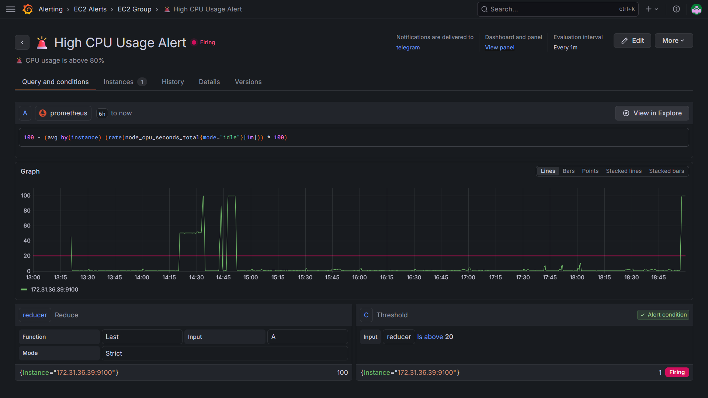

# 🚀 EC2 Monitoring System (Prometheus + Grafana)

## 📌 Overview

This project demonstrates a production-level monitoring system for AWS EC2 instances using Prometheus and Grafana.

## 🔧 Features

* Real-time CPU, Memory, Disk monitoring
* Network traffic & Disk IO tracking
* Multi-instance support using Grafana variables
* Alerting system with Telegram integration 🚨
* Cost optimization panel (detect idle resources 💰)
* Instance metadata dashboard

## 🏗 Architecture

Prometheus → Collects metrics
Node Exporter → Exposes system metrics
Grafana → Visualizes dashboards

## 📊 Dashboard Preview


## 🚨 Alert Example



## ⚙️ Setup Instructions

### 1. Run services

```bash
docker-compose up -d
```

### 2. Access

* Grafana → http://localhost:3000
* Prometheus → http://localhost:9090

## 🧠 Learnings

* PromQL queries
* Monitoring system design
* Alerting strategies
* Cost optimization thinking

## 🛠 Tech Stack

* Prometheus
* Grafana
* Docker
* AWS EC2

## 🔗 Author

Khushi Chunarkar
