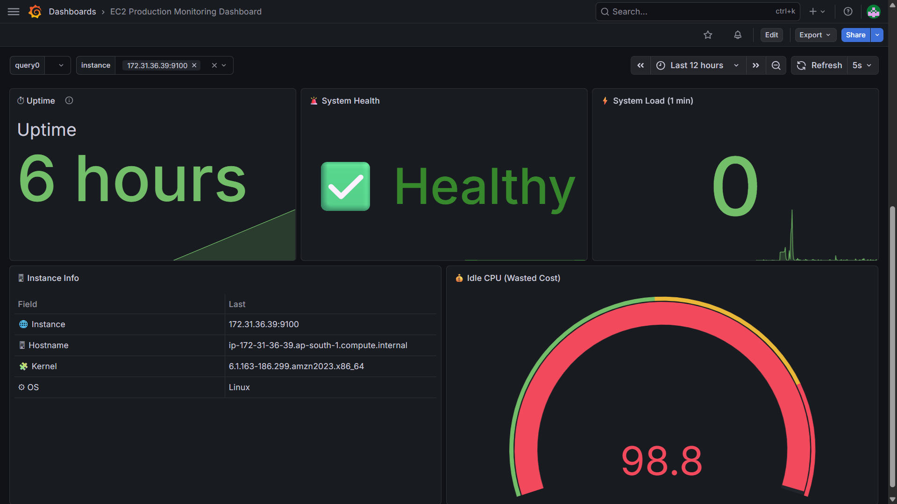
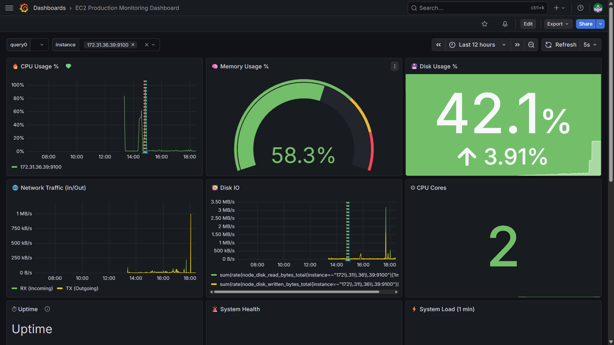
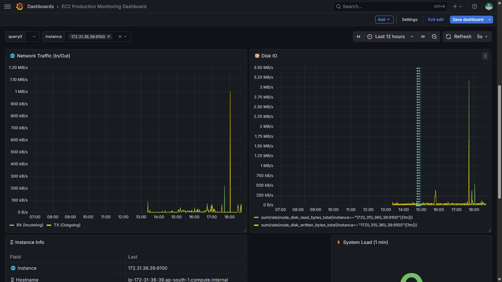
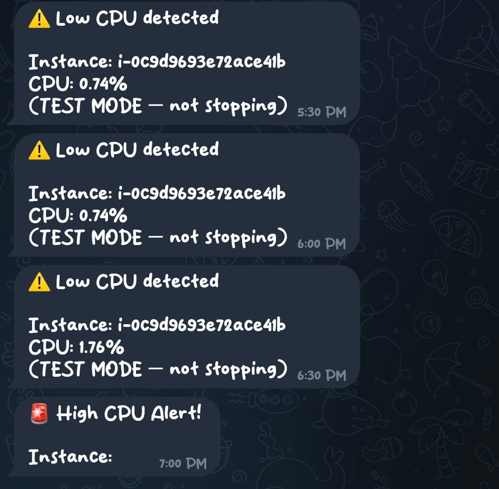
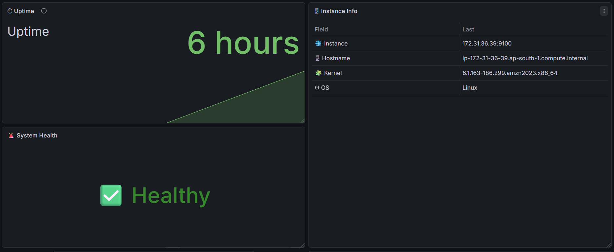
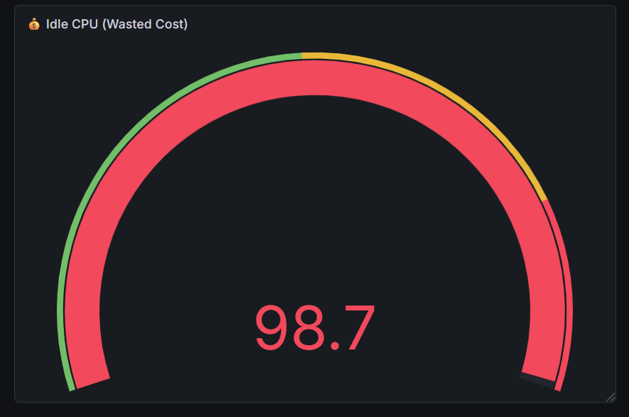

# 👋 Hi, I'm Khushi

🚀 Aspiring DevOps Engineer

---

# 🚀 EC2 Real-Time Monitoring System

<p align="center">
  
</p>

---

## 🧠 Overview

A **production-ready monitoring and alerting system** built on AWS EC2 using:

* Prometheus (metrics collection)
* Node Exporter (system metrics)
* Grafana (visualization)
* Telegram (real-time alerts)

👉 Designed to simulate **real-world DevOps observability systems**

---

## ⚡ Key Highlights

* 📊 Real-time infrastructure monitoring
* 🚨 Automated alerting system (Telegram integration)
* 🔽 Multi-instance support with dynamic dropdown
* 💽 Disk IO & CPU core tracking
* ⏱ Uptime & system health monitoring
* 💰 Cost optimization (idle resource detection)

---

## 🏗 Architecture

```text
EC2 Instance
   ↓
Node Exporter
   ↓
Prometheus
   ↓
Grafana Dashboard
   ↓
Telegram Alerts
```

---

## 📊 Dashboard Features

| Category        | Metrics                     |
| --------------- | --------------------------- |
| 🔥 System       | CPU, Memory, Disk           |
| 🌐 Performance  | Network Traffic, Disk IO    |
| ⚙ Hardware      | CPU Cores                   |
| 🧠 Health       | Uptime, Load, System Status |
| 📋 Metadata     | Instance Info               |
| 💰 Optimization | Idle CPU detection          |

---

# 📸 Screenshots

## 📊 Full Monitoring Dashboard

<p align="center">
  
  
</p>

---

## 🌐 Network & Performance



---

## 🚨 Alert Trigger (Grafana / Telegram)

<p align="center">
  
  
</p>

---

## 🖥 System Information & Health



---

## 💰 Cost Optimization Panel



---

## ⚙️ Setup Guide

### 1️⃣ Clone repository

```bash
git clone https://github.com/Khushi-677/ec2-monitoring.git
cd ec2-monitoring
```

---

### 2️⃣ Start services

```bash
docker-compose up -d
```

---

### 3️⃣ Access

* Grafana → http://localhost:3000
* Prometheus → http://localhost:9090

---

### 4️⃣ Configure Grafana

* Add Prometheus as data source
* Import dashboard JSON (optional)

---

## 📊 Prometheus Config

```yaml
global:
  scrape_interval: 15s

scrape_configs:
  - job_name: 'node_exporter'
    static_configs:
      - targets: ['localhost:9100']
```

---

## 🧠 Learnings

* Observability & monitoring fundamentals
* PromQL query writing
* Real-time alerting strategies
* Dashboard design & visualization
* Cloud cost optimization mindset

---

## 🛠 Tech Stack

<p>
  
  
  
  
  
</p>

---

## 💼 Why This Project?

This project demonstrates:

✔ Real-world DevOps practices
✔ Monitoring + Alerting system design
✔ Cloud infrastructure understanding
✔ Production-level dashboard building

---

## 🔗 Project Link

👉 https://github.com/Khushi-677/ec2-monitoring

---

## 📫 Let's Connect

Open to DevOps & Cloud opportunities 🚀
